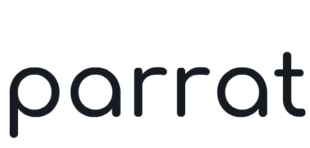

<p align="center">
  <picture>
    <source media="(prefers-color-scheme: dark)" srcset="assets/parrat-logo-dark.png">
    <source media="(prefers-color-scheme: light)" srcset="assets/parrat-logo-light.png">
    
  </picture><br />
  <picture>
    <source media="(prefers-color-scheme: dark)" srcset="assets/parrat-name-dark.png">
    <source media="(prefers-color-scheme: light)" srcset="assets/parrat-name-light.png">
    
  </picture>
</p>

<p align="center">AI-powered root cause analysis for data incidents.</p>

<p align="center">
  <a href="https://www.npmjs.com/package/parrat"></a>
  <a href="LICENSE"></a>
</p>

---

Smart engineers shouldn't spend their evenings chasing breakage across vendor walls. Parrat puts the toil where it belongs: on the agent, not the human.

Parrat is an open-source CLI that uses Claude to investigate data incidents. Point it at your data stack, describe the problem, and get a root cause in under 90 seconds — with a full audit trail.

**Validated across 11 live investigations with 100% correct root causes at an average cost of $0.07 per investigation.**

## Quick Start

**Prerequisites:** Node.js 20+, Python, a configured dbt project (`~/.dbt/profiles.yml`), and an `ANTHROPIC_API_KEY`.

All commands below run from your dbt project root. Navigate there first:

```bash
cd your-dbt-project/
```

**1. Install dbt-mcp**

Parrat connects to your dbt project via [dbt-mcp](https://github.com/dbt-labs/dbt-mcp):

```bash
pip install uv
```

`uvx` (included with uv) fetches and runs dbt-mcp automatically when Parrat starts a Skill — nothing else to install.

**2. Set your Anthropic API key**

```bash
export ANTHROPIC_API_KEY=sk-ant-...
# or add it to a .env file in your project root
```

**3. Install Parrat and create config**

```bash
npm install -g parrat
```

Run `parrat init` to create the config:

```bash
parrat init
```

You should see: `Configuration written to .parrat/config.yaml`. Open that file and fill in the `mcpServers` block:

```yaml
mcpServers:
  dbt:
    command: uvx
    args: [dbt-mcp]
    env:
      DBT_PROJECT_DIR: .
      DBT_PATH: dbt
      PYTHONUTF8: "1"  # Windows only
```

`DBT_PROJECT_DIR: .` resolves to your dbt project root as long as you run `parrat` from that directory. If `DBT_PATH: dbt` fails (dbt not on your PATH), replace it with the absolute path to your dbt executable — see [#4 below](#4-verify-and-run) for how to find it.

**4. Verify and run**

```bash
parrat doctor                        # checks API key, config, and dbt-mcp connectivity
parrat run freshness-investigation   # investigates all sources in your project
```

If `parrat run` fails with a dbt path error, dbt is likely installed in a virtual environment rather than globally. Find the path and update `DBT_PATH` in `.parrat/config.yaml`:

```bash
# Mac / Linux
which dbt

# Windows
where dbt
```

If those return nothing, look inside your virtual environment directly:

```
# Mac / Linux
.venv/bin/dbt

# Windows
.venv\Scripts\dbt.exe
```

---

## How it works

Parrat runs **Skills** — pre-codified investigation playbooks that reason across your stack using a deliberately thin set of tools. Each Skill gives Claude access to only the tools it needs for that specific investigation, producing predictable, auditable reasoning paths.

Every run writes to an append-only audit log. Every run is replayable.

## Skills

A Parrat Skill is a TypeScript module — not a markdown file. Each Skill defines a typed input/output contract (Zod schema), a constrained set of dbt-mcp tools it's allowed to call, and an `async run()` function that drives the investigation. The TypeScript boundary is what makes every run replayable: Parrat logs the exact inputs, tool calls, and Claude reasoning steps as structured, hash-verified events. A prompt file can't provide that guarantee.

> **If you're familiar with Claude Code Skills (`.md` files):** those are natural-language instructions Claude interprets at chat time. Parrat Skills are operational code — deterministic, auditable, and independently testable. Same word, different layer. Parrat follows the same pattern established across the agent ecosystem: the [Anthropic Agent SDK](https://docs.anthropic.com/en/docs/agents-and-tools/tool-use/overview), [LangChain Tools](https://python.langchain.com/docs/concepts/tools/), and [OpenAI function definitions](https://platform.openai.com/docs/guides/function-calling) all define Skills/Tools as typed code for the same reason — determinism, testability, and structured output.

| Skill | What it investigates |
|---|---|
| `freshness-investigation` | Why is this source stale? Which downstream models are at risk? |
| `metric-drop-rca` | Why did this metric drop? Which upstream model caused it? |
| `lineage-analysis` | What does this model depend on, and what depends on it? |

## Run an investigation

> Replace `my_project` with your dbt project name (from `dbt_project.yml`) and `my_source` with your source name (from `sources.yml`).

**Freshness investigation** — no input required. Investigates all sources with freshness configs:

```bash
parrat run freshness-investigation

# or investigate a specific source (source_name.table_name):
parrat run freshness-investigation '{"source": "my_source.orders"}'
```

**Metric drop RCA** — pass the metric and model context:

```bash
parrat run metric-drop-rca '{"metric_name":"revenue","model_id":"model.my_project.fct_revenue","metric_column":"amount","drop_percent":25}'
```

**Lineage analysis** — pass the dbt node ID:

```bash
parrat run lineage-analysis '{"node_id":"model.my_project.fct_orders"}'
```

Parrat returns a structured root cause with confidence rating. The full reasoning chain is logged to `.parrat/audit.jsonl`.

## Replay any investigation

```bash
parrat replay <run_id>
```

The run ID is printed at the end of each investigation and also visible in `.parrat/audit.jsonl`. Every investigation is replayable — every tool call, every Claude turn, input tokens, output tokens, cost, and duration.

## Privacy

Parrat has no backend. There is no Parrat server, no telemetry, and no data collection.

**What stays on your machine:**
- Your `parrat.config.yaml` and any credentials in it
- The audit log (`.parrat/audit.jsonl`)
- Your dbt project files

**What goes to Anthropic's API:**
- The investigation input you pass to `parrat run`
- Query results returned by your MCP tools (e.g. dbt-mcp `show` output, row counts, lineage data)
- Claude's reasoning turns during the investigation

This is the same data boundary as using [Claude Code](https://claude.ai/code) against your codebase. Anthropic's [usage policies](https://www.anthropic.com/legal/usage-policy) and [privacy policy](https://www.anthropic.com/legal/privacy) apply to API traffic. If you are on the Anthropic API (not Claude.ai), Anthropic does not train on your data by default.

**What never leaves your machine:** raw database credentials, your full warehouse schema, or any data not explicitly retrieved by a tool call during an investigation.

## License

Apache 2.0 — see [LICENSE](LICENSE).

---

Built by [Raguvind Tharanitharan](https://raguvind.com).
